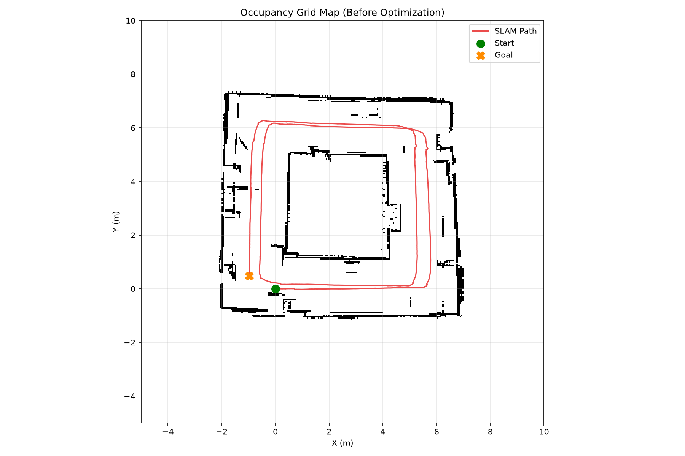
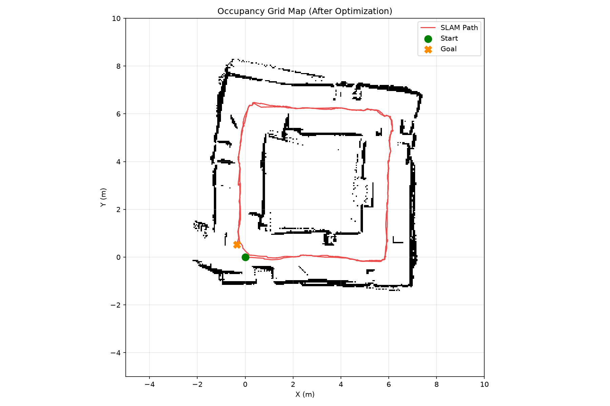
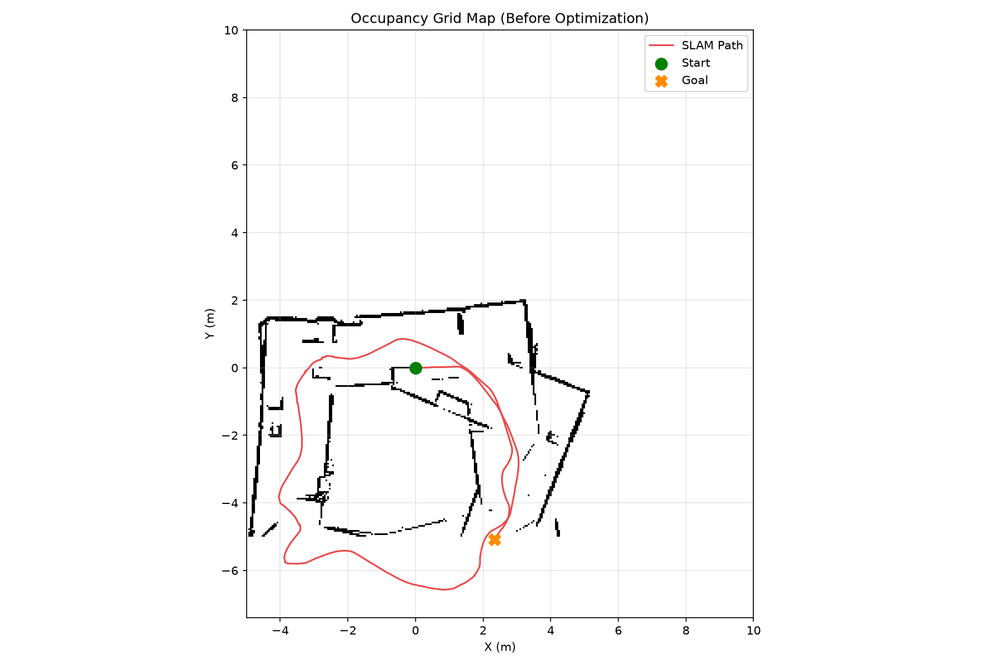
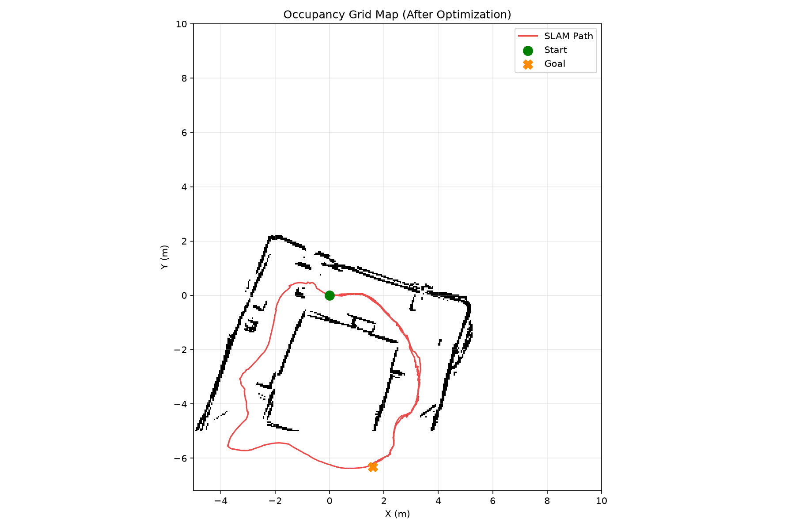
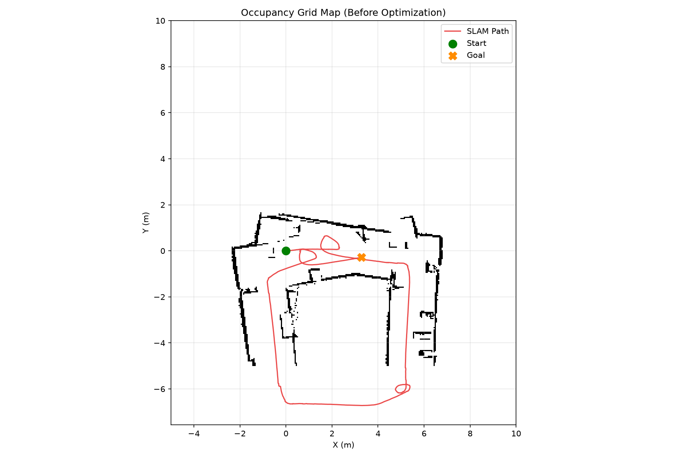
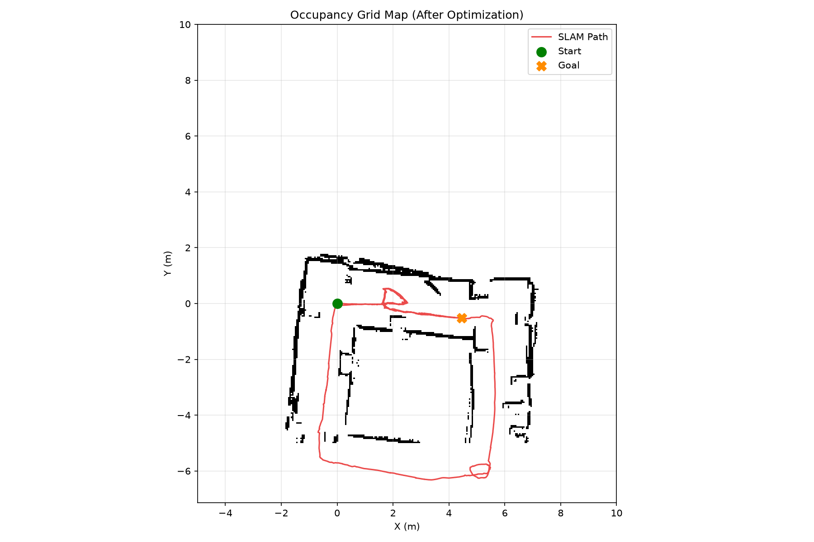
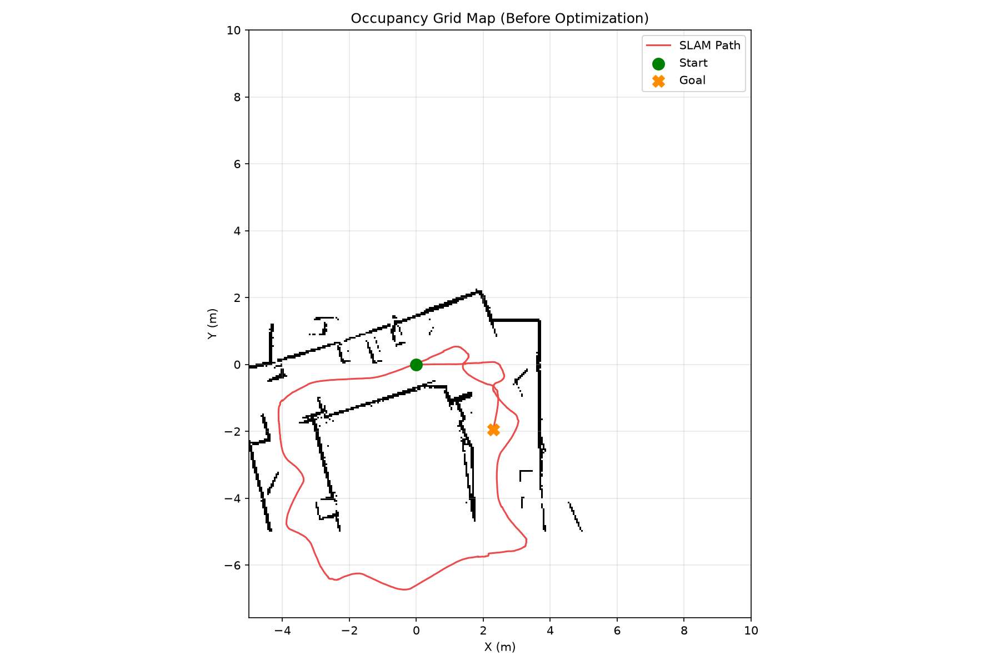
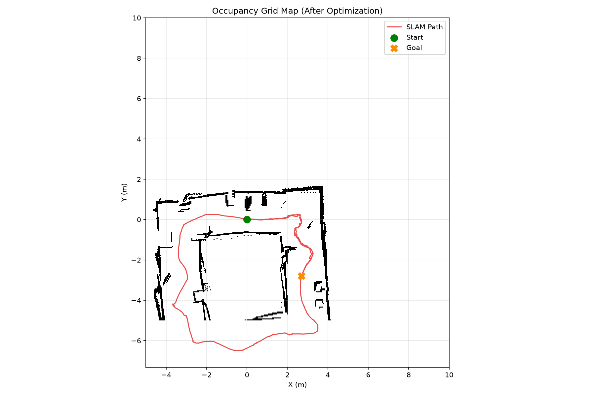

# LiDAR-Based SLAM

This project implements a LiDAR-Based Simultaneous Localization and Mapping (SLAM) framework for a differential-drive robot. Initial odometry from encoder and IMU data is refined with LiDAR scan matching (ICP) and pose-graph optimization (GTSAM). Occupancy grids evaluate trajectory quality before and after optimization.

## File Structure

```text
LiDAR-Based_SLAM/
├── code/
│   ├── icp.py
│   ├── load_data.py
│   ├── main.py
│   ├── util/
│   │   ├── helpers.py       # odometry, LiDAR, geometry helpers
│   │   └── occupancy.py     # occupancy grid + map plotting
│   └── sim/                 # 2D simulator + path drawing
├── data_sim/                # generated locally
│   └── env1/, env2/, ...    # per-run sensor logs
├── result/                  # occupancy maps before/after optimization
└── requirements.txt
```

## Requirements

```bash
python3 -m venv .venv
source .venv/bin/activate
pip install -r requirements.txt
```

`gtsam==4.2.1` needs **NumPy 1.26.x**. Avoid SciPy 1.18+ (requires NumPy 2).

## Getting started

1. Generate sim data (draws a path by default):

```bash
cd code/sim
python3 generate_dataset.py
```

2. Run SLAM (loads latest `data_sim/envN`):

```bash
cd code
python3 main.py
```

Outputs: occupancy maps before/after optimization in `result/` as `envN_occupancy_before_opt.png` / `envN_occupancy_after_opt.png`.

## Results

### Env1 — before vs after optimization

| Before | After |
|--------|-------|
|  |  |

### Env2 — before vs after optimization

| Before | After |
|--------|-------|
|  |  |

### Env3 — before vs after optimization

| Before | After |
|--------|-------|
|  |  |

### Env4 — before vs after optimization

| Before | After |
|--------|-------|
|  |  |
